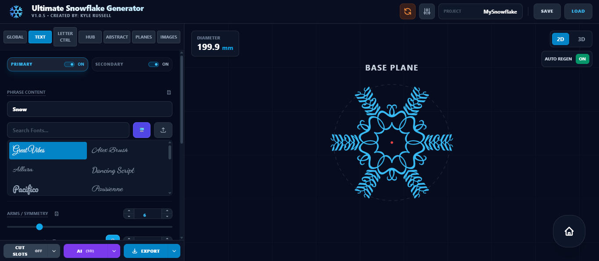
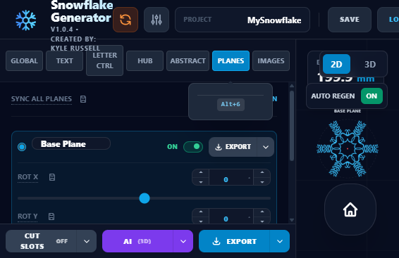
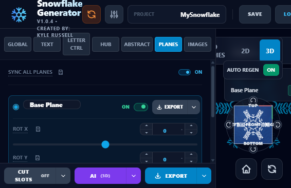
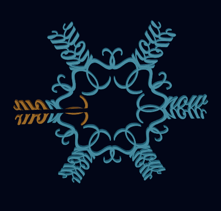
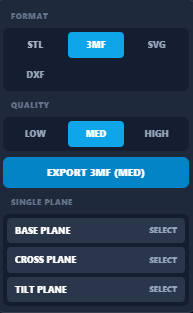

# Ultimate Snowflake Generator - Created by Kyle Russell

## Download
- Windows Installer: [Snowflake.Generator.Setup.1.0.8.exe](https://github.com/kar883/Ultimate-Snowflake-Generator/releases/download/v1.0.8/Snowflake.Generator.Setup.1.0.8.exe)
- Windows ZIP: [Snowflake.Generator-1.0.8-win.zip](https://github.com/kar883/Ultimate-Snowflake-Generator/releases/download/v1.0.8/Snowflake.Generator-1.0.8-win.zip)
- macOS DMG: [Snowflake.Generator-1.0.8-arm64.dmg](https://github.com/kar883/Ultimate-Snowflake-Generator/releases/download/v1.0.8/Snowflake.Generator-1.0.8-arm64.dmg)
- macOS ZIP: [Snowflake.Generator-1.0.8-arm64-mac.zip](https://github.com/kar883/Ultimate-Snowflake-Generator/releases/download/v1.0.8/Snowflake.Generator-1.0.8-arm64-mac.zip)
- Linux AppImage: [Snowflake.Generator-1.0.8.AppImage](https://github.com/kar883/Ultimate-Snowflake-Generator/releases/download/v1.0.8/Snowflake.Generator-1.0.8.AppImage)
- All release assets: [GitHub Releases](https://github.com/kar883/Ultimate-Snowflake-Generator/releases)

Inspired by Jexom https://www.thingiverse.com/thing:2702278 I quickly found the limits of OpenSCAD and wanted to see if I could improve on that program.  
Design complex 2D and 3D snowflakes from text, hubs, abstracts, and multi-plane controls, then export for 3D printing or vector workflows.
  Inspired by Jexom https://www.thingiverse.com/thing:2702278 I quickly found the limits of OpenSCAD and wanted to see if I could improve on that program.  

## What You Can Do
- Create your own unique snowflakes by customizing text, individual letter behavior, central hubs, abstract designs, fractals, and images (svg). 
- Build across 1, 2 or 3 planes (Base, Cross, and Tilt planes) and have each plane interlock when assembled.
- Use advanced slot controls, including 3-plane slot adjustments. Bridges for the slots are automatically added (but can be turned off) to help reduce free floating bodies. 
- Customize text, letter behavior, hubs, abstracts, and global geometry.
- Toggle 2D/3D preview in real time.
- Export STL, 3MF, SVG, DXF, and save/load project JSON.
- Automatic export estimation (file size, triangle count, export time) and warnings for potential issues (disconnected bodies).

## Screenshots

### Text + Live Preview

### Plane Controls (Multi-Plane)

### 3D View

 - the app detects disconnected bodies and highlights them in orange to help identify potential issues before exporting/3d printing.

### Export Options

- Exporting in low quality is usually sufficient and faster. Higher quality is available but takes longer to export and files are significantly larger.

## Tips
- Start with simple text and 1 plane to get familiar, then explore more complex features.
- Do most of your modeling in the 2D view to keep things fast and turn off "auto regenerate 3D" for faster editing. When you are ready to see the 3D model, turn auto regenerate back on and toggle the 3D preview to see your changes in real time.
- Use the 3D previews "ID Bodies" to check for free floating/disconnected bodies before exporting for 3d printing.

## Plane Sync Modes
- Sync All Planes ON (synchronous mode): text, hub, abstract, and image pattern changes are applied to all enabled planes together.
- Sync All Planes OFF (asynchronous mode): each plane keeps its own independent text/pattern settings, and only the active plane is edited when you change controls.
- In asynchronous mode, the active plane is visually emphasized in 2D and 3D previews so you can quickly see which plane you are editing.

## Share Your Designs
 - Please show me what you were able to with this app. Upload a picutre of your design or the .json file to https://github.com/kar883/Ultimate-Snowflake-Generator/tree/main/Examples
   
## License

This project is licensed under
[Creative Commons Attribution-NonCommercial 4.0 International (CC BY-NC 4.0)](https://creativecommons.org/licenses/by-nc/4.0/).

